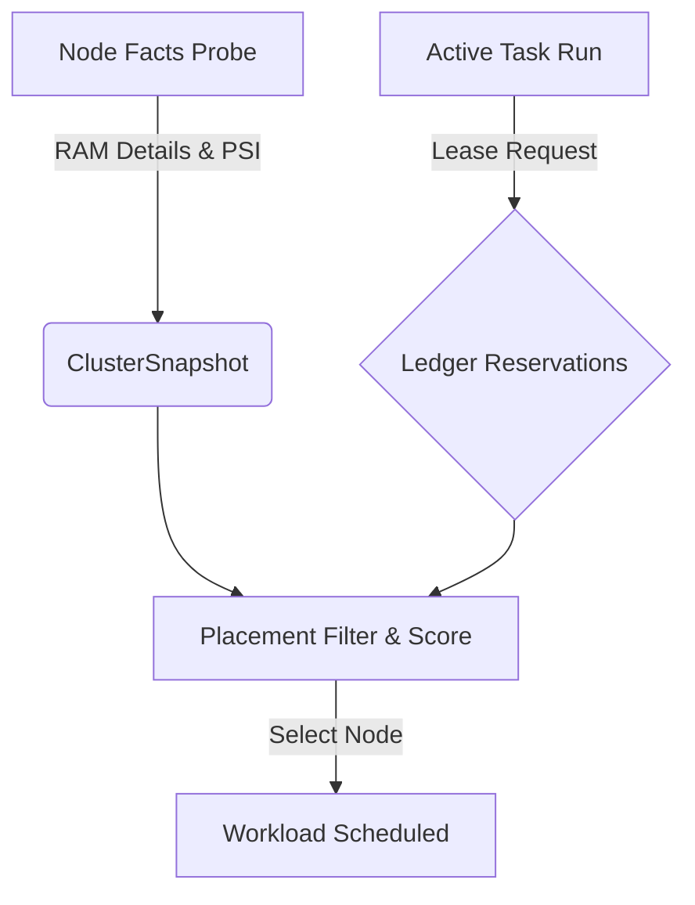

# AXIS RAM Balancing: Implementation Plan

**Reference Document:** [ram-balancing-research.md](file:///home/cranium/axis/docs/ram-balancing-research.md)  
**Target Version:** v0.11.0 (Phase A Core Integration)  
**Status:** Design Proposal / Ready for Implementation  

---

## 1. Executive Summary

This document details the step-by-step engineering plan to implement a **pressure-aware, lease-based cluster RAM balancer** in AXIS. It shifts the scheduler from sorting nodes strictly by instantaneous free memory (which causes hot-spot thrashing) to scheduling based on **Allocatable Headroom, Leased soft-claims, and Linux kernel PSI (Pressure Stall Information)**.



---

## 2. Resource & Task Models

We will extend the core data structures to represent system reserves and soft-claims:

### A. Node Model Extensions ( [internal/models/types.go](file:///home/cranium/axis/internal/models/types.go) )
Add fields to `Resources` to distinguish between raw limits and allocatable space:
```go
type Resources struct {
	// ... existing fields ...
	RAMTotalMB             int64          `json:"ram_total_mb" yaml:"ram_total_mb"`
	RAMFreeMB              int64          `json:"ram_free_mb" yaml:"ram_free_mb"`
	RAMSystemReservedMB    int64          `json:"ram_system_reserved_mb" yaml:"ram_system_reserved_mb"`
	RAMEvictionReservedMB  int64          `json:"ram_eviction_reserved_mb" yaml:"ram_eviction_reserved_mb"`
	RAMAllocatableMB       int64          `json:"ram_allocatable_mb" yaml:"ram_allocatable_mb"`
	
	// Linux Pressure Stall Information (PSI)
	MemoryPSISomeAvg10     float64        `json:"memory_psi_some_avg10,omitempty" yaml:"memory_psi_some_avg10,omitempty"`
	MemoryPSIFullAvg10     float64        `json:"memory_psi_full_avg10,omitempty" yaml:"memory_psi_full_avg10,omitempty"`
}
```

### B. Task Model Extensions
The existing `GuardedExecutionRequest` and placement specifications will support memory constraints:
```go
type TaskRequirements struct {
	// ... existing fields ...
	MemoryRequestMB int64 `json:"memory_request_mb" yaml:"memory_request_mb"`
	MemoryMaxMB     int64 `json:"memory_max_mb,omitempty" yaml:"memory_max_mb,omitempty"`
}
```

---

## 3. Implementation Sequence

### Phase 1: Fact Collection & OS Probing
We must populate the new model fields during fact gathering.

1. **Linux System Probes ( [internal/facts/local.go](file:///home/cranium/axis/internal/facts/local.go) )**:
   * **PSI Probing**: Read `/proc/pressure/memory`. Parse `some avg10` and `full avg10` percentages.
   * **Eviction Reserves**: Define a default safety floor of 512MB (or 5% of total RAM).
   * **System Reserves**: Read custom settings from `~/.axis/nodes.yaml` (defaulting to 1024MB if omitted).
   * **Compute Allocatable**: Calculate `Allocatable = Total - SystemReserved - EvictionReserved`.
2. **macOS System Probes ( [internal/facts/local_darwin.go](file:///home/cranium/axis/internal/facts/local_darwin.go) )**:
   * Probe memory pressure via `sysctl vm.page_free_target` or VM statistics. Map macOS memory pressure states to nominal PSI levels.

### Phase 2: Lease-based Ledger Integration
AXIS currently features a scaffolded `Ledger` in [ledger.go](file:///home/cranium/axis/internal/reservation/ledger.go). We must integrate it fully:

1. **Active Leases**: Every `axis task run` will register a memory reservation entry inside the ledger with a default Time-To-Live (`LeaseTTL`, e.g., 5 minutes) and execution owner information.
2. **Lease Eviction Loop**: The local API daemon (`axis serve`) will run a periodic background loop (every 10 seconds) calling `Ledger.Prune()` to automatically evict expired reservations and stale heartbeats.
3. **Effective Headroom Calculation**:
   * For each node: `EffectiveHeadroom = Allocatable - Max(RequestedMem, LeasedMem)`.

### Phase 3: Placement Filter & Score Updates
Modify the placement ranker in [ranker.go](file:///home/cranium/axis/internal/placement/ranker.go) to utilize the new metrics:

1. **Stage 1 (Filter)**:
   * Disqualify any node where `EffectiveHeadroom < Task.MemoryRequestMB`.
   * Disqualify any node suffering from severe memory pressure (`MemoryPSIFullAvg10 > 70.0` or PSI-indicated thrashing).
2. **Stage 2 (Score)**:
   * **Pressure Penalization**: Apply a gradient penalty (up to `-25` points) for non-zero memory pressure (`PSISomeAvg10` or high Load Avg).
   * **Cluster Skew Penalty**: Compute the standard deviation of leased memory across all active workers. Deduct points from nodes that increase the skew to distribute the memory load evenly across the cluster.

---

## 4. Verification & Testing Criteria

To maintain the project's strict coverage standards:

### A. Unit Tests
* **Probing Tests**: Add mocks for `/proc/pressure/memory` parsing.
* **Ledger Tests**: Assert that `Ledger.Prune()` correctly evicts expired entries and that parent-child de-duplication functions properly under various nested workloads.
* **Placement Tests**:
  * Verify that a task requesting 4GB of RAM is scheduled on a lower-memory-pressure node even if a high-pressure node technically has larger raw free space.
  * Verify that topology skew constraints successfully prevent scheduling three consecutive memory-heavy tasks on the same high-capacity worker.

### B. Integration Tests
Add golden file tests inside `cmd/axis/` to verify command outputs:
* `axis placement explain` prints detailed reasoning for `Allocatable Headroom` and `PSI Pressure Stalls`.
* `axis task run --memory-request=2048` successfully creates a leased entry in `~/.axis/state.json`.
